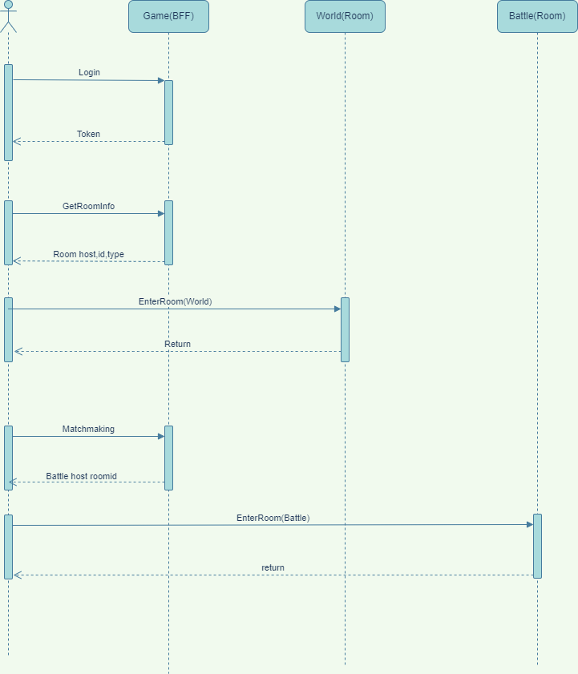
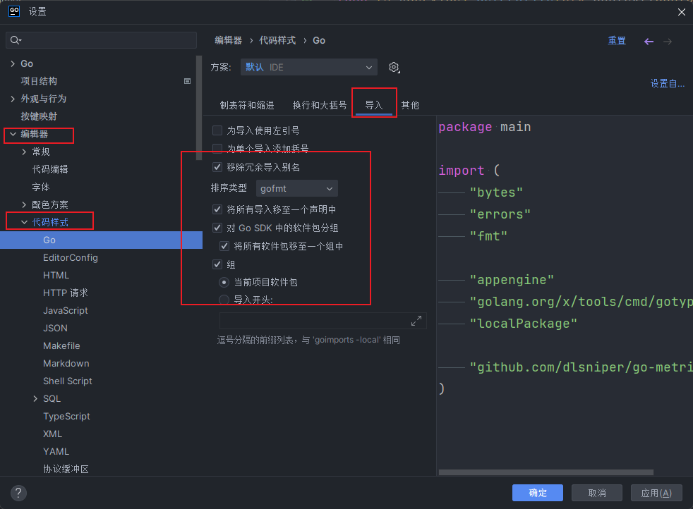

# Rumble
## Introduction
  Rumble game service
* cmd/rumble:  all in one  rumble service
* cmd/bff: rumble bff service
* cmd/room: rumble battle/world service
* cmd/game_cli: rumble client

## Architecture

## GameFlow

## Prepare

1. Set Go env
   ```shell
      go env -w GOPRIVATE="gitlab.powerup.ifun.com/powerup/*"
   ```
2. [Install buf](https://buf.build/docs/installation)

## Set imports format




