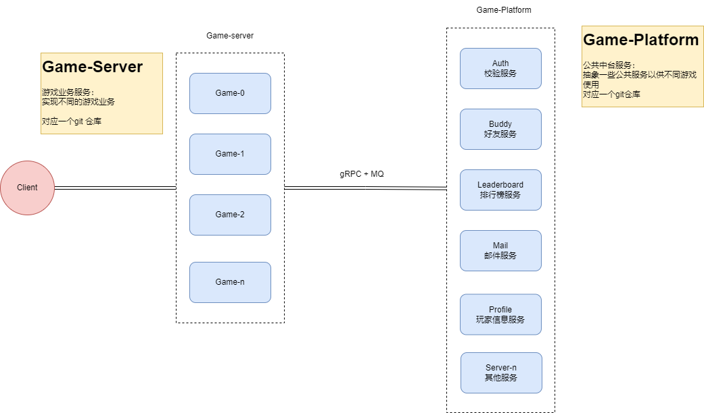

# Game
## Introduction

game service

* cmd/game:  all in one service
* cmd/bff:  backend for frontend
* cmd/room: game battle/world service
* cmd/game_cli: game client

## Architecture

## GameFlow

## Prepare
2. [Install buf](https://buf.build/docs/installation)

