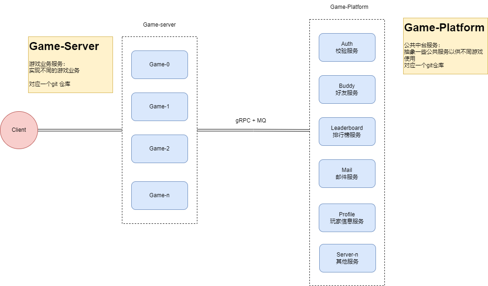

# Game Servers

## Introduction

This project is a game server template,
which is designed to provide a basic game server framework for developers.

## Architecture



### Topologies

| Entry | Path | Use when |
|-------|------|----------|
| **Aggregate** | `cmd/game0/service` | Local/dev: game + in-process platform modules (`AuthAllModule`) |
| **Thin** | `cmd/game0/service-thin` | Prod-like split: game-only + remote platform clients (`AuthMiddlewareModule`) |

Public game APIs require auth by default (`AuthMiddlewareModule` / `AuthAllModule`). Do not embed `utility.WithoutAuth` on public services.

Default `AllModule` exposes **gRPC + HTTP only**. TCP/zinx is **not** covered by AuthMiddleware (uid can be spoofed); enable only via `TcpModule` / `AllWithTCPModule` on trusted networks.

Copy `.env.example` → `.env` for AUTH/TLS/CORS/NATS/Mongo/Redis knobs.

**`AUTH_URL`:**
- Aggregate: keep aligned with `PORT` (`.env.example` default `localhost:8081`).
- Thin: override to a **remote** AuthService (e.g. `localhost:8082`). Do not use this game's `PORT` — thin does not host auth.

## How to run

* deploy infrastructure:
  ```shell
   # add ./deployment/docker-compose/.env file to custom your environment if you have
   docker compose -f ./deployment/docker-compose/infrastructure.yaml up -d
  ```

* run service (aggregate):
  ```shell
  # fix the game-name to your game name 
    go run ./cmd/{game-name}/service/main.go
  ```

* or thin (remote platform auth/clients must already be reachable):
  ```shell
    # override AUTH_URL away from PORT, e.g. AUTH_URL=localhost:8082
    go run ./cmd/game0/service-thin/main.go
  ```

## How to build docker image?

```shell
# replace <your_register_url> to your register url,eg: game0.registry.com
# replace <your_server_name> to your server name,eg: game0,gm
# replace <your_git_access_token> to your git access token
# how to get your git access token?: https://docs.github.com/en/authentication/keeping-your-account-and-data-secure/managing-your-personal-access-tokens#creating-a-personal-access-token-classic
docker buildx build -t <your_register_url>:latest --build-arg APP_NAME=<your_server_name> --build-arg GIT_PWD=<your_git_access_token>  -f .\build\package\docker\Dockerfile . --push
```

## How to test

### Integration Test

* build your interactive client:
   ```shell
     go build -o {game-name}.exe ./cmd/{game-name}/client/main.go 
   ```
* run your interactive client:
    ```shell
     # aggregate (auth on same host)
     ./{game-name} grpc --host localhost:8081
     # thin (auth on remote AUTH_URL)
     ./{game-name} grpc --host localhost:8081 --auth-host localhost:8082
     # flow: auth token → game token <access> → game hi
    ```
  tips: http client use Postman to connect `localhost:8081`.

### Load Test

* install [k6](https://grafana.com/docs/k6/latest/get-started/installation/)
* run k6 load test
   ``` shell
    # aggregate (auth on same host as game)
    k6 run ./tests/game0/game0.js
    # thin: Authenticate against remote auth
    AUTH_HOST=127.0.0.1:8082 SERVER_HOST=127.0.0.1:8081 k6 run ./tests/game0/game0.js
  ```

## Proto file Manage

* install [buf](https://buf.build/docs/installation)

* manage proto file
  ```shell
   #  generate proto file
    buf generate
  ```
  ```shell
   # use buf Schema Registry to manage proto file
   # you need to sign up and login to buf Schema Registry,follow the steps below:
   # https://buf.build/docs/tutorials/getting-started-with-bsr#prerequisites
    buf registry login username 
   # push proto file to buf Schema Registry
    buf push
  ```
* generate SDKS for different languages
    * visit https://buf.build/everyjoy/{game-name}/sdks
    * choose the language you want to generate, and follow the cmd to import the SDKS to your project.
  

      